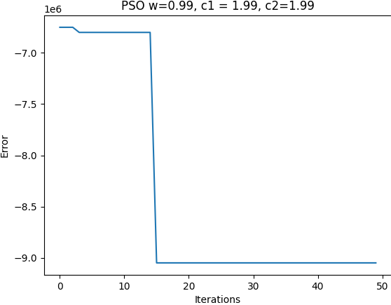

# Ambitious Thief Problem - Particle Swarm Optimization (PSO)

|  |
|:----------------------------------------------------------:|
| Result of best solution, parameters: 10 particles, epochs 50, 7 dimensions, -10 min x, 10 max x, 0.99 inertia, 1.99 C1, 1.99 C2. Total gain = 9050000 |


This project solves the "Ambitious Thief Problem" using the Particle Swarm Optimization (PSO) algorithm. The problem consists of selecting the most valuable items from a list while adhering to a weight constraint. The goal is to maximize the total value of the stolen goods without exceeding the weight limit of 10 kg.

## Problem Statement
A thief enters a house and finds a room filled with valuable objects. However, he only has a small backpack that can carry a maximum of 10 kg. The challenge is to determine which items he should take to maximize the total value.

### Available Items:
| Item                     | Value ($)     | Weight (kg) |
|--------------------------|--------------|------------|
| Bag of Centenarios       | 750,000      | 2.5        |
| Stack of $1000 bills     | 500,000      | 1.0        |
| Large Jewelry Box        | 2,750,000    | 6.0        |
| Small Jewelry Box        | 950,000      | 2.5        |
| Stamp Collection         | 1,850,000    | 1.5        |
| Artwork                 | 3,250,000    | 3.0        |
| Gold Paperweight        | 3,950,000    | 5.0        |

## Implementation Details
The problem is formulated as an optimization problem where:
- Each item is represented as a binary decision (0 = not taken, 1 = taken).
- The total weight of selected items must not exceed 10 kg.
- The objective function maximizes the total value of selected items while adhering to constraints. 
- PSO is used to find an optimal or near-optimal solution.

## Running the Script
To execute the solution, run the following command:
```bash
python pso.py --np 30 --mxe 10 --dim 7 --minx -10 --maxx 10 --w 0.99 --c1 1.99 --c2 1.99 --output ./ambicious_thief --dir ./dataset/ambicious_thief.csv --binary 'True'
```
### Command-line Arguments:
- `--np`: Number of particles in the swarm.
- `--mxe`: Maximum number of iterations (epochs).
- `--dim`: Number of dimensions (corresponding to the number of items).
- `--minx` / `--maxx`: Search space boundaries.
- `--w`: Inertia weight.
- `--c1`: Cognitive coefficient.
- `--c2`: Social coefficient.
- `--output`: Directory to store results.
- `--dir`: Path to the dataset.
- `--binary`: Whether to output binary selection results.

## Output
The script generates:
- The best solution found (selected items and total value).
- The error of the best solution.
- Performance metrics such as execution time and convergence behavior.

## Requeriments
Ensure you have the following installed:
- NumPy
- Matplotlib
- Pandas
```bash
pip install numpy matplotlib pandas
```

## Notes
- The solution can be fine-tuned by adjusting PSO parameters.
- Results may vary based on the random initialization of particles.
- The script supports additional constraint functions and error functions, which can be modified in `error_functions.py` and `constraints.py`. 

