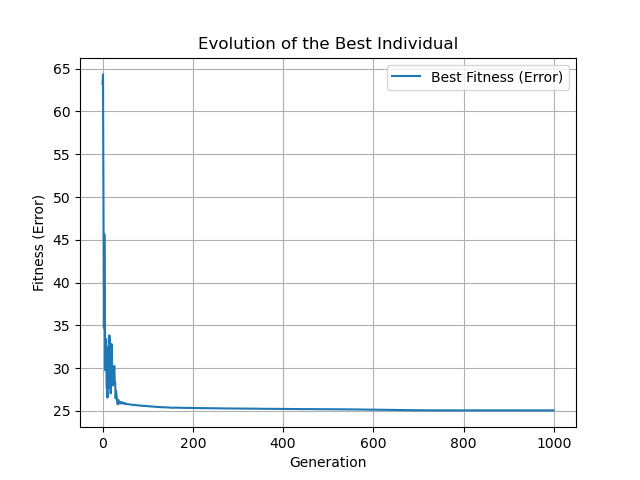
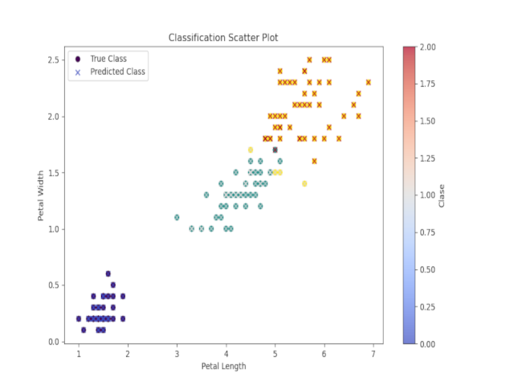

# Classification of the IRIS Dataset using a Genetic Algorithm

|               |               |               |
|---------------|---------------|---------------|
|  |   |
|Fitness Evolution   | Classification Scatter Plot   |

This project implements a Genetic Algorithm (GA) to classify the well-known Fisher's IRIS dataset using a discriminant function. The goal is to evolve parameters for a linear equation that best separates the three Iris species based on petal length and petal width.

## Dataset
We use the IRIS dataset, which consists of:
- 150 samples
- 3 classes (Setosa, Versicolor, and Virginica)
- 4 features per sample: Sepal Length, Sepal Width, Petal Length, and Petal Width

### Dataset Source
The dataset is publicly available from multiple machine learning repositories, such as UCI Machine Learning Repository.

## Problem Definition
The objective is to classify the IRIS dataset using the following linear equation:

$f(PetalLength, PetalWidth) = \frac{A}{B} \cdot PetalLength + \frac{C}{D} \cdot PetalWidth + \frac{E}{F}$

Where:
- `A, B, C, D, E, F` are parameters optimized by the Genetic Algorithm.
- The function outputs values close to `0`, `1`, or `2`, representing the three Iris classes.

## Installation and Usage
### Prerequisites
- Python 3.x
- Required Python libraries:
  - `numpy`
  - `pandas`
  - `matplotlib`
  - `deap`
  - `tqdm`

Install dependencies using:
```sh
pip install numpy pandas matplotlib deap tqdm
```

### Running the Algorithm
The script uses command-line arguments to set GA parameters.
Example usage:
```sh
python GA.py --pop "(10,100)" --pc "(0.7,0.9)" --pm "(0.6,0.7)" --g "(900,1000)" --ev eval_classification --sp "(-100,100)" --dp iris.csv --output results/
```

Where:
- `--pop` defines the population size range.
- `--pc` sets the probability of crossover.
- `--pm` sets the probability of mutation.
- `--g` defines the number of generations.
- `--ev` selects the evaluation function (`eval_classification`).
- `--sp` defines the solution space bounds.
- `--dp` specifies the dataset path.
- `--output` is the directory for saving results.

## Genetic Algorithm Implementation
### Chromosome Representation
Each chromosome consists of six real-valued parameters `(A, B, C, D, E, F)`, evolved to minimize classification error.

### Selection, Crossover, and Mutation
- **Selection:** Tournament selection (size = 3)
- **Crossover:** Blend crossover (alpha = 0.5)
- **Mutation:** Gaussian mutation (mu = 0, sigma = 0.5, indpb = 0.2)

### Fitness Function
The fitness function minimizes the classification error:
$$
Error = \left| f(PetalLength, PetalWidth) - \text{target\_class} \right|
$$

where `target_class` is 0, 1, or 2.

## Results
After evaluating 2424 parameter configurations, the best found solution achieved:
- **Population Size:** 110
- **Crossover Probability:** 0.9
- **Mutation Probability:** 0.7
- **Generations:** 1000
- **Best Fitness Score:** Near-optimal classification

### Classification Performance
- Fisher’s Linear Discriminant Analysis achieves ~98% accuracy (2% error).
- Our GA-based classifier achieves a similar accuracy depending on parameter tuning.

## Summary 6 runs

In the table a summary of 6 runs is presented, including the best run and 5 randomly chosen runs to see how it performs with different
randomly chosen to see how it behaves with different runs.

| Pops  | Pc   | Pm  | G    | Best Fitness | Best solution                                      | C. Time (s) |
|-------|------|-----|------|--------------|-----------------------------------------------------|-------------|
| 110.0 | 0.7  | 0.6 | 995  | 25.06        | [-16.37, -119.52, -28.33, -41.37, -7.66, 22.38]    | 12.57       |
| 60.0  | 0.89 | 0.6 | 999  | 25.06        | [-16.11, -117.64, 55.15, 80.52, -87.54, 255.61]    | 7.61        |
| 10.0  | 0.99 | 0.7 | 995  | 27.51        | [-6.08, 118.31, -59.26, -55.56, -28.32, 198.40]    | 1.33        |
| 10.0  | 0.7  | 0.7 | 999  | 27.73        | [7.481, -120.41, 69.53, 62.23, -18.07, 131.31]     | 1.22        |
| 10.0  | 0.79 | 0.6 | 999  | 28.03        | [-7.61, 106.79, 73.65, 64.04, 7.87, -62.65]        | 1.22        |


## Conclusion
This project demonstrates the application of Genetic Algorithms to optimize a classification function for the IRIS dataset. The evolved discriminant function achieves comparable accuracy to Fisher’s LDA while exploring various parameter configurations.

## References
- Fisher, R. A. (1936). The use of multiple measurements in taxonomic problems.
- DEAP Library: https://deap.readthedocs.io/en/master/
- UCI Machine Learning Repository: https://archive.ics.uci.edu/ml/datasets/iris

