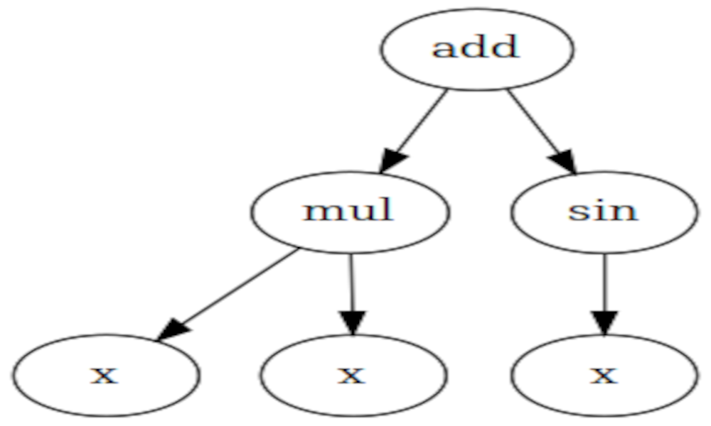

# Symbolic Regression using Genetic Programming

|               |               |               |
|---------------|---------------|---------------|
| iteration_2_2024-11-26_22-31-27.png) |   |
|Best Fitness   | Best syntactic tree   |

This project implements symbolic regression using Genetic Programming (GP) with the DEAP framework. The goal is to approximate the function:

$$ y = x^2 + \sin(x) $$


using a population of mathematical expressions evolved through genetic operators such as crossover, mutation, and selection.

## Installation
To run this project, you need Python and the required dependencies installed. You can install them using:

```bash
pip install numpy pandas deap tqdm matplotlib
```

## Usage
The script allows tuning of multiple genetic algorithm parameters. Run the script with the following arguments:

```bash
python reg_simb.py --cxb "0.1,0.6" --mut "0.5,0.9" --gen "1,4" --npop "100,125" --function "f_exam" --output ./f_x2_plus_sin_x --label_func "y = x² + sin(x)"
```

### Parameters:
- `--cxb`: Crossover probability range (min, max)
- `--mut`: Mutation probability range (min, max)
- `--gen`: Number of generations (min, max)
- `--npop`: Population size (min, max)
- `--function`: Error function to evaluate individuals
- `--output`: Directory to store results
- `--label_func`: Label for plots

## Results
### Summary of 10 best and worst experiments
| **Exp** | **Cross** | **Mut** | **Gen** | **Pop** | **Función**                            | **Error**      | **Tiempo de Ejec.** |
|---------|-----------|---------|---------|---------|----------------------------------------|----------------|---------------------|
| 2       | 0.1       | 0.5     | 3       | 100     | add(mul(x, x), sin(x))                | 0.0            | 0.06787             |
| 10      | 0.1       | 0.9     | 3       | 100     | sub(mul(x, x), sin(neg(x)))           | 0.0            | 0.08615             |
| 27      | 0.1       | 0.5     | 3       | 125     | mul(x, mul(x, mul(x, x)))             | 0.0            | 0.13604             |
| 12      | 0.1       | 0.9     | 3       | 125     | add(mul(x, x), mul(x, sin(x)))        | 0.0            | 0.07719             |
| 13      | 0.1       | 0.6     | 2       | 125     | add(mul(x, x), sin(x))                | 0.0            | 0.08453             |
| 6       | 0.6       | 0.6     | 3       | 100     | add(mul(x, x), sin(x))                | 0.0            | 0.06601             |
| 16      | 0.1       | 0.5     | 3       | 125     | add(mul(x, x), sin(x))                | 0.0            | 0.07756             |
| 9       | 0.6       | 0.6     | 2       | 100     | mul(x, x)                             | 0.35           | 0.05178             |
| 4       | 0.6       | 0.5     | 3       | 125     | mul(x, x)                             | 0.4            | 0.05521             |
| 29      | 0.6       | 0.9     | 2       | 125     | mul(x, x)                             | 0.47           | 0.05729             |
| 32      | 0.1       | 0.5     | 3       | 125     | add(mul(x, 1), add(x, 1))             | 22241574.9403  | 0.05149             |


### Best Expression Found
The best expression that approximates the target function was:

```python
add(mul(x, x), sin(x))
```

This expression perfectly matches y = x² + sin(x), achieving an error of **0.0** on the training set.

### Experimental Setup
- **Dataset:** 200 random points in the range [-100, 100]
- **Train-Test Split:** 70% training, 30% testing
- **Population Sizes Tested:** 100, 125
- **Generations Tested:** 1 to 4
- **Crossover Probabilities Tested:** 0.1 to 0.6
- **Mutation Probabilities Tested:** 0.5 to 0.9
- **Total Experiments:** 36

### Performance Metrics
- **Best Model Execution Time:** 0.06787 seconds
- **Worst Model Expression:** `add(mul(x, 1), add(x, 1))` with high error

## Visualization
The project generates:
1. **Function Plots** - Shows how the evolved function fits the dataset.
2. **Syntax Trees** - Graphical representation of the best expression found.
3. **CSV Summary** - Stores results of different experimental runs.

## Conclusion
This implementation successfully applied Genetic Programming to symbolic regression, discovering the target function with zero error. The methodology demonstrates how evolutionary algorithms can be used for function approximation and automatic equation discovery.

